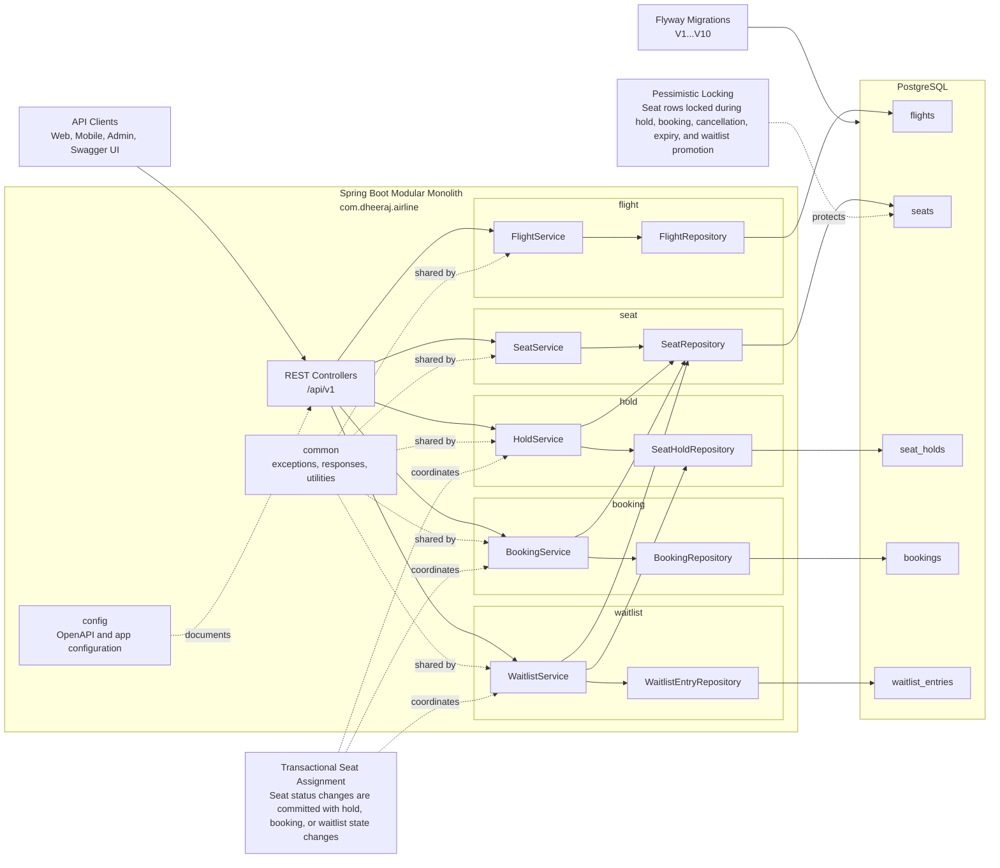
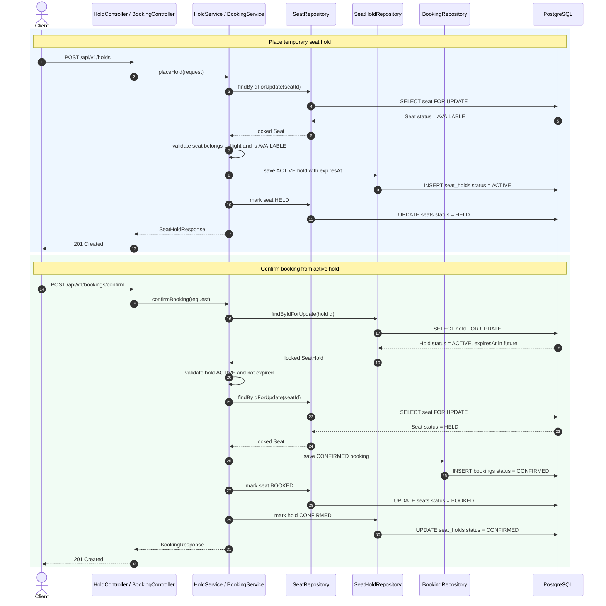

# Airline Reservation and Seat Inventory Platform

A Java 21 and Spring Boot backend for managing flight inventory, seat availability, temporary holds, confirmed bookings, cancellations, booking history, hold history, and waitlist promotion.

This project is built as a modular monolith with production-style boundaries, transactional service flows, Flyway-managed schema evolution, PostgreSQL persistence, Swagger/OpenAPI documentation, and integration tests backed by Testcontainers.

The core engineering challenge is not basic CRUD. The heart of the system is safely moving limited seat inventory through states such as `AVAILABLE`, `HELD`, and `BOOKED` while multiple users may be trying to reserve the same seat at the same time.

## High-Level Flow Demo

For a non-technical walkthrough of the happy path, open the animated demo:

[High-Level Seat Hold and Booking Flow Demo](docs/high-level-flow-demo.html)

It shows how a traveler finds a flight, selects a seat, receives a temporary hold, confirms the booking, and ends with the seat safely marked as booked.

## Project Overview

The platform supports the first major backend milestones of an airline reservation system:

- flight creation
- seat creation
- flight search by origin, destination, and date
- seat availability lookup
- temporary seat holds
- booking confirmation from an active hold
- booking cancellation with seat restoration
- expired hold release
- booking history with pagination, sorting, and filtering
- hold history with pagination, sorting, and filtering
- waitlist join
- waitlist promotion into a temporary seat hold

The API is versioned under `/api/v1`, and the codebase is organized by domain module so the project can grow without collapsing into a flat controller-service-repository structure.

## Why This Project Matters

Airline reservation systems are deceptively hard because inventory is finite, high-value, and often contested. A seat cannot be treated like a simple row in a CRUD table. It has a lifecycle, it is affected by time-based holds, and it must remain correct under concurrent requests.

This project demonstrates backend engineering skills that matter in real systems:

- designing stateful workflows instead of isolated CRUD endpoints
- using transactions around business operations
- applying pessimistic locking where inventory correctness matters
- validating schema changes through Flyway instead of relying on runtime auto-DDL
- separating persistence identifiers from business identifiers
- returning consistent API errors through global exception handling
- testing important flows against a real PostgreSQL database
- keeping a modular monolith clean enough to evolve toward larger architecture later

## Tech Stack

- Java 21
- Spring Boot
- Spring Web MVC
- Spring Data JPA
- PostgreSQL
- Flyway
- Lombok
- Docker Compose
- Testcontainers
- Swagger/OpenAPI via springdoc-openapi
- Maven

## Architecture

The application is organized as a modular monolith under the root package:

```text
com.dheeraj.airline
```

Each business area owns its controllers, DTOs, entities, repositories, services, and mappers where applicable.





## Module Breakdown

### `flight`

Owns flight inventory creation and retrieval.

Responsibilities:

- create scheduled flights
- validate flight number uniqueness
- expose flight metadata such as route, aircraft code, departure time, arrival time, and status

### `seat`

Owns seat inventory for a flight.

Responsibilities:

- create seats for flights
- enforce unique seat numbers per flight
- expose all seats for a flight
- expose available seats for reservation flows

### `search`

Owns flight discovery.

Responsibilities:

- search flights by origin, destination, and departure date
- return results sorted by departure time

### `hold`

Owns temporary reservation of seats.

Responsibilities:

- place active seat holds
- release specific active holds
- release expired holds
- expose hold history with pagination, sorting, and filtering

### `booking`

Owns confirmed reservation records.

Responsibilities:

- confirm booking from an active hold
- generate business booking references
- retrieve bookings
- cancel bookings
- expose booking history with pagination, sorting, and filtering

### `waitlist`

Owns waitlist queue behavior.

Responsibilities:

- join a flight waitlist
- prevent duplicate active entries for the same passenger and flight
- preserve queue position
- promote the next eligible waitlist entry into a temporary hold
- respect preferred cabin class during promotion

### `common`

Owns reusable platform concerns.

Responsibilities:

- custom exceptions
- standard error responses
- reusable paginated response DTO
- business identifier generation utilities

### `config`

Owns application-level configuration.

Responsibilities:

- Swagger/OpenAPI metadata and tag grouping
- framework configuration as the platform grows

## Domain Model

### `Flight`

Represents a scheduled flight.

Key fields:

- `id`
- `flightNumber`
- `aircraftCode`
- `origin`
- `destination`
- `departureTime`
- `arrivalTime`
- `status`

Statuses:

- `SCHEDULED`
- `CANCELLED`
- `CLOSED`

### `Seat`

Represents an individual seat on a flight.

Key fields:

- `id`
- `flight`
- `seatNumber`
- `cabinClass`
- `status`

Statuses:

- `AVAILABLE`
- `HELD`
- `BOOKED`

Cabin classes:

- `ECONOMY`
- `PREMIUM_ECONOMY`
- `BUSINESS`
- `FIRST`

### `SeatHold`

Represents a temporary claim on a seat.

Key fields:

- `id`
- `flightId`
- `seatId`
- `holdReference`
- `passengerName`
- `passengerEmail`
- `status`
- `heldAt`
- `expiresAt`

Statuses:

- `ACTIVE`
- `EXPIRED`
- `RELEASED`
- `CONFIRMED`

### `Booking`

Represents a confirmed reservation created from a hold.

Key fields:

- `id`
- `bookingReference`
- `flightId`
- `seatId`
- `holdId`
- `status`
- `bookedAt`
- `cancelledAt`

Statuses:

- `CONFIRMED`
- `CANCELLED`

### `WaitlistEntry`

Represents a passenger waiting for an available seat on a flight.

Key fields:

- `id`
- `flightId`
- `passengerName`
- `passengerEmail`
- `preferredCabinClass`
- `queuePosition`
- `status`
- `promotedHoldId`
- `createdAt`

Statuses:

- `ACTIVE`
- `PROMOTED`
- `CANCELLED`

## Key Hold, Booking, and Waitlist Flows

### Temporary Seat Hold

When a user places a hold:

1. The flight must exist.
2. The seat must exist and belong to the requested flight.
3. The seat row is locked with pessimistic locking.
4. The seat must still be `AVAILABLE`.
5. A `SeatHold` is created with status `ACTIVE`.
6. The hold expiration is set to now plus 10 minutes.
7. The seat status changes to `HELD`.

This flow prevents two concurrent requests from successfully holding the same seat.

### Hold Release

When a hold is manually released:

1. The hold must exist.
2. The hold must be `ACTIVE`.
3. The hold row and seat row are handled transactionally.
4. The hold status changes to `RELEASED`.
5. The seat status returns to `AVAILABLE`.

Confirmed, expired, or already released holds cannot be manually released.

### Expired Hold Release

When expired holds are released:

1. The system finds `ACTIVE` holds where `expiresAt` is before the current time.
2. Each affected seat is locked before modification.
3. The hold status changes to `EXPIRED`.
4. The seat status returns to `AVAILABLE`.

This keeps inventory from being stranded in `HELD` status.

### Booking Confirmation

When a booking is confirmed:

1. The hold must exist.
2. The hold must be `ACTIVE`.
3. The hold must not be expired.
4. The seat row is locked with pessimistic locking.
5. The seat must still be `HELD`.
6. A booking is created with a unique `BOOK-XXXXXX` reference.
7. The booking status becomes `CONFIRMED`.
8. The seat status becomes `BOOKED`.
9. The hold status becomes `CONFIRMED`.

This gives the system an explicit handoff from temporary reservation to final booking.

### Booking Cancellation

When a booking is cancelled:

1. The booking must exist.
2. The booking must be `CONFIRMED`.
3. The seat row is locked with pessimistic locking.
4. The booking status changes to `CANCELLED`.
5. `cancelledAt` is recorded.
6. The seat status returns to `AVAILABLE`.

Already cancelled bookings cannot be cancelled again.

### Waitlist Join

When a passenger joins the waitlist:

1. The flight must exist.
2. The passenger must not already have an `ACTIVE` waitlist entry for the same flight.
3. The entry is assigned the next queue position for that flight.
4. The entry starts with status `ACTIVE`.

The waitlist is intentionally modeled as part of inventory flow rather than as a separate toy feature.

### Waitlist Promotion

When the next waitlist entry is promoted:

1. The flight must exist.
2. Active waitlist entries are evaluated by queue position.
3. The system finds an available seat, respecting preferred cabin class when present.
4. The selected seat row is locked with pessimistic locking.
5. A temporary hold is created for the waitlisted passenger.
6. The seat status changes to `HELD`.
7. The waitlist entry changes to `PROMOTED`.
8. The entry stores the promoted hold id.

Promotion does not directly create a booking. It gives the passenger a temporary hold, preserving the same hold-to-booking lifecycle used by the rest of the system.

## Concurrency Explanation

The project uses pessimistic locking for critical seat inventory transitions. This is important because the seat is the scarce resource. If two requests try to hold, confirm, cancel, expire, or promote against the same seat at the same time, the database must serialize access to that row.

Critical flows that lock seat rows:

- placing a hold
- confirming a booking
- cancelling a booking
- releasing expired holds
- promoting a waitlist entry into a hold

This approach prioritizes correctness and explainability. For a reservation system, it is better to make one user wait briefly than to accidentally sell or hold the same seat twice.

## Hold Expiration Explanation

Temporary holds prevent a seat from being booked by someone else while the passenger completes the next step. However, a hold cannot last forever. Otherwise seats would become unavailable indefinitely.

Current behavior:

- holds expire after 10 minutes
- expired holds cannot be confirmed
- released holds cannot be confirmed
- confirmed holds cannot be released
- expired hold release restores seats to `AVAILABLE`

The current milestone exposes an explicit expired-hold release endpoint. A future production version could run the same service logic from a scheduler, queue consumer, or background job.

## API List

Base path:

```text
/api/v1
```

### Flights

| Method | Endpoint | Purpose |
| --- | --- | --- |
| `POST` | `/api/v1/flights` | Create a flight |
| `GET` | `/api/v1/flights/{flightId}` | Get flight by id |

### Flight Search

| Method | Endpoint | Purpose |
| --- | --- | --- |
| `GET` | `/api/v1/flights/search?origin=DEL&destination=BOM&departureDate=2030-05-11` | Search flights with query params |
| `POST` | `/api/v1/flights/search` | Search flights with request body |

### Seats

| Method | Endpoint | Purpose |
| --- | --- | --- |
| `POST` | `/api/v1/seats` | Create a seat for a flight |
| `GET` | `/api/v1/seats/flights/{flightId}/seats` | List all seats for a flight |
| `GET` | `/api/v1/seats/flights/{flightId}/seats/available` | List available seats for a flight |

### Holds

| Method | Endpoint | Purpose |
| --- | --- | --- |
| `POST` | `/api/v1/holds` | Place a temporary seat hold |
| `GET` | `/api/v1/holds` | List hold history with pagination/filtering |
| `POST` | `/api/v1/holds/{holdId}/release` | Release an active hold |
| `POST` | `/api/v1/holds/release-expired` | Expire old active holds and restore seats |

Hold history query params:

- `passengerEmail`
- `flightId`
- `status`
- `page`
- `size`
- `sortBy`
- `direction`

### Bookings

| Method | Endpoint | Purpose |
| --- | --- | --- |
| `POST` | `/api/v1/bookings/confirm` | Confirm booking from active hold |
| `GET` | `/api/v1/bookings/{bookingId}` | Get booking by id |
| `GET` | `/api/v1/bookings` | List booking history with pagination/filtering |
| `POST` | `/api/v1/bookings/{bookingId}/cancel` | Cancel confirmed booking |

Booking history query params:

- `passengerEmail`
- `flightId`
- `status`
- `page`
- `size`
- `sortBy`
- `direction`

### Waitlist

| Method | Endpoint | Purpose |
| --- | --- | --- |
| `POST` | `/api/v1/waitlist` | Join a flight waitlist |
| `GET` | `/api/v1/flights/{flightId}/waitlist` | List active waitlist entries for a flight |
| `POST` | `/api/v1/flights/{flightId}/waitlist/promote-next` | Promote next eligible entry into a temporary hold |
| `POST` | `/api/v1/waitlist/{waitlistEntryId}/cancel` | Cancel an active waitlist entry |

## Error Handling

The application uses global exception handling to return clean JSON errors.

Standard error response fields:

- `timestamp`
- `status`
- `error`
- `message`
- `path`

Common exception types:

- `ResourceNotFoundException`
- `DuplicateResourceException`
- `BusinessRuleViolationException`

This makes API behavior predictable for validation failures, missing resources, duplicate resources, and domain rule violations.

## Database Design

Schema evolution is managed through Flyway migrations.

Current tables:

- `flights`
- `seats`
- `seat_holds`
- `bookings`
- `waitlist_entries`

Design highlights:

- UUID primary keys
- unique flight numbers
- unique booking references
- unique seat numbers per flight
- foreign keys between inventory tables where appropriate
- indexes for flight search, seat lookup, active hold lookup, booking lookup, and waitlist lookup
- partial uniqueness for active waitlist entries by passenger and flight

The application uses JPA schema validation rather than allowing Hibernate to mutate the schema automatically. Flyway owns database evolution.

## Local Setup

### Prerequisites

- Java 21
- Docker Desktop
- Maven wrapper included in the project

### Start PostgreSQL

```bash
docker compose up -d
```

Local database defaults:

- host: `localhost`
- port: `5437`
- database: `airline_reservation_db`
- username: `postgres`
- password: `password`

### Run the Application

```bash
./mvnw spring-boot:run
```

### Swagger/OpenAPI

Swagger UI:

```text
http://localhost:8080/swagger-ui.html
```

OpenAPI JSON:

```text
http://localhost:8080/api-docs
```

## Test Strategy

The test strategy focuses on behavior that must work against a real database.

The project uses:

- Spring Boot integration tests
- MockMvc for HTTP-level API testing
- PostgreSQL Testcontainers
- Flyway migrations applied to ephemeral test databases
- real JPA repositories and transactions

Covered scenarios include:

- flight creation
- seat creation
- flight search
- successful seat hold
- duplicate hold prevention
- booking confirmation
- expired hold rejection
- booking cancellation with seat restoration
- expired hold release with seat restoration
- lifecycle hardening for holds and bookings
- booking history filters
- hold history filters
- pagination metadata
- waitlist join
- duplicate active waitlist prevention
- waitlist promotion into a hold
- preferred cabin class promotion
- waitlist cancellation rules
- queue order preservation

This is intentionally integration-heavy because pessimistic locking, transaction boundaries, Flyway migrations, and PostgreSQL behavior cannot be fully trusted through mocks alone.

Run tests:

```bash
./mvnw test
```

## Engineering Standards Demonstrated

- modular monolith design
- versioned REST API
- transactional service-layer workflows
- pessimistic locking for high-contention inventory
- explicit state machines for seats, holds, bookings, and waitlist entries
- Flyway-first database migration strategy
- JPA schema validation
- standardized error responses
- reusable paginated response DTO
- generated business identifiers such as `BOOK-XXXXXX`
- concise structured logging for important lifecycle events
- Swagger/OpenAPI documentation
- Dockerized local development
- Testcontainers-based integration testing

## Design Decisions

### Modular Monolith First

The project uses a modular monolith because the domain benefits from strong internal boundaries, but does not yet need distributed-system complexity. Seat holds, booking confirmation, cancellation, and waitlist promotion are transaction-sensitive flows that are simpler and safer in one deployable application.

### Hold Before Booking

Bookings are created from holds rather than directly from available seats. This mirrors realistic reservation systems where temporary allocation and final confirmation are separate steps.

### Pessimistic Locking for Inventory

The system locks seat rows during critical inventory changes. This reduces ambiguity under concurrent access and makes the database the final authority for seat availability.

### Explicit Expiration

Hold expiration is part of the domain model, not a background cleanup afterthought. Expired holds cannot be confirmed, and release logic restores inventory safely.

### Waitlist Promotion Creates Holds

Waitlist promotion does not skip the reservation lifecycle. It creates a temporary hold, which keeps waitlist behavior consistent with normal booking flow and leaves room for payment or confirmation steps later.

### Flyway Owns Schema

Schema changes are versioned, reviewable, and repeatable. Hibernate validates the schema but does not generate it.

## Future Enhancements

- scheduled expired hold cleanup
- authentication and authorization
- passenger/customer accounts
- idempotency keys for hold and booking requests
- payment authorization before booking confirmation
- seat maps by aircraft type
- aircraft-specific seat generation
- fare classes and dynamic pricing
- waitlist notifications
- automatic waitlist promotion after cancellation or hold expiry
- outbox pattern for reservation events
- metrics, tracing, and operational dashboards
- admin APIs for flight closure and disruption handling
- richer search filters and availability summaries

## Project Positioning

This project is designed as a serious backend portfolio system. It shows practical judgment around transaction boundaries, concurrency, schema ownership, API design, testing strategy, and modular code organization.

The goal is not to build every airline feature at once. The goal is to build the core reservation and inventory engine in a way that is correct, explainable, extensible, and interview-ready.
